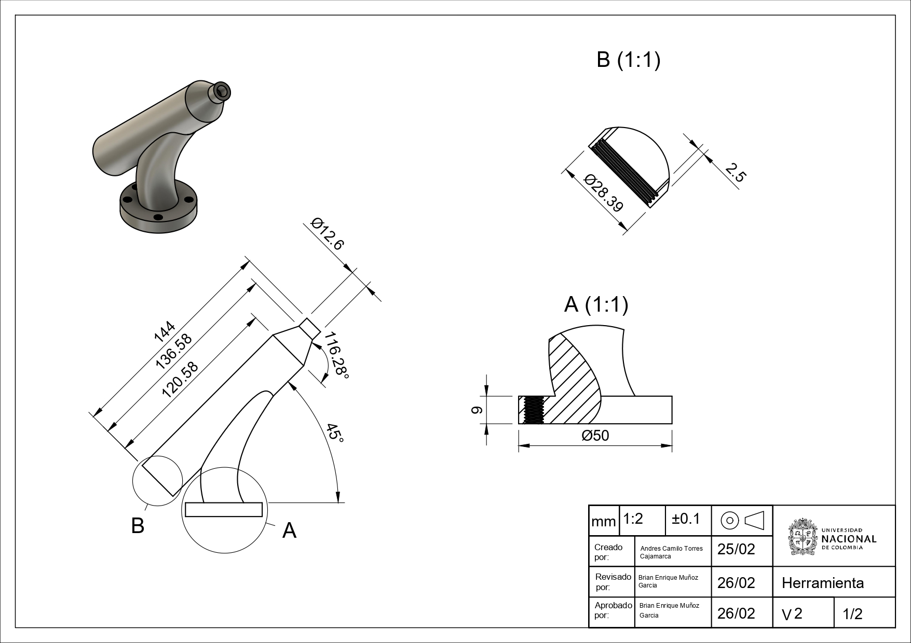
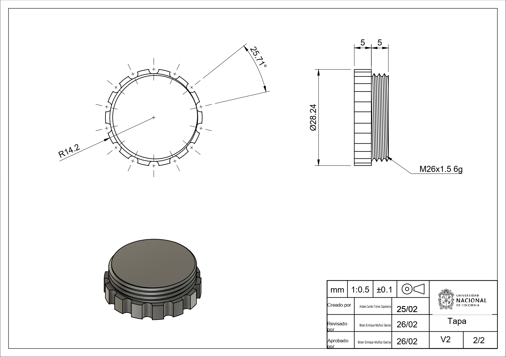

# Laboratorio 1 - Robótica Industrial - "Trayectorias, Entradas y Salidas Digitales"

***Participantes***
__Andres Camilo Torres Cajamarca__
__Brian Enrique Muñoz Garcia__

## Descripción Solución Planteada

## Diagrama de Flujo de acciones del robot

## Plano de planta de la ubicación de cada uno de los elementos

## Descripción de las funciones empleadas

## Diseño de la herramienta

Para el diseño de la herramienta se consideraron los siguientes parametros de diseño:

* Tamaño del marcador
* Tamaño de soporte principal
* Fuerzas ejercidadas por el robot
* Ángulo de la superficie
* Tolerancias

Teniendo en cuenta esto, se tomaron las respectivas medidas del marcador y teniendo en cuenta la hoja de datos del robot se procedió a hacer un boceto de la herramienta como se ve en la siguiente imagen y por facilidad para alcanzar la superficie y evitar tener inconvenientes con la concordancia de los sistemas coordenados se diseñó la herramienta a 45°

Una vez teniendo esto, se tuvo en cuenta que la herramienta se pretendía hacer por medio de manufactura aditiva con impresión 3D por lo cual se tenia que tener en cuenta ciertas tolerancias debido a la expansión y contracción termica que podria sufrir el PLA por este método de manufactura.

Una vez teniendo en cuenta estos parametros se diseñó la herramienta que se ve en los siguientes planos.

Al realizar la impresión 3D se obtuvo la siguiente herramienta.

## Código en RAPID

## Video Demostrativo
