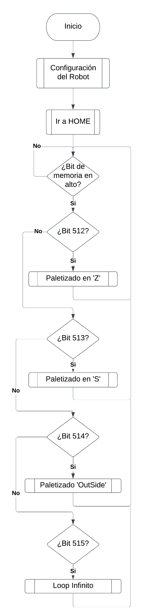
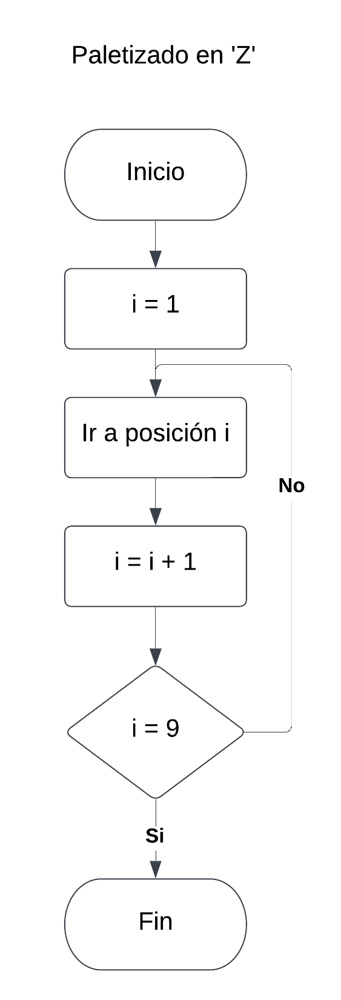
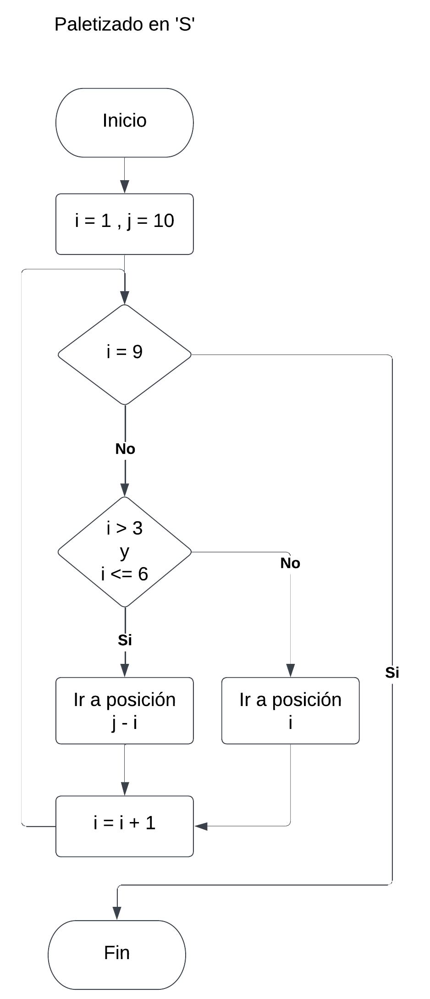
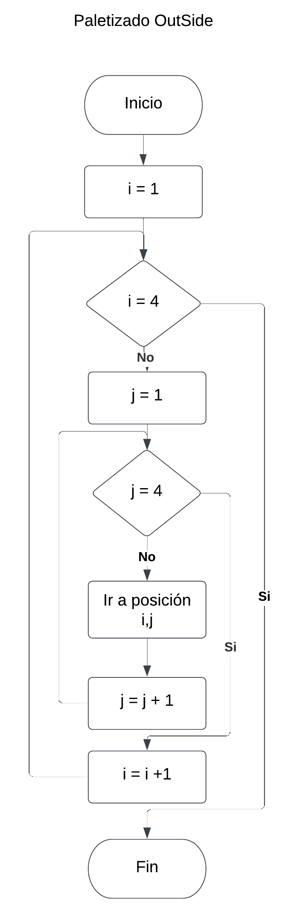
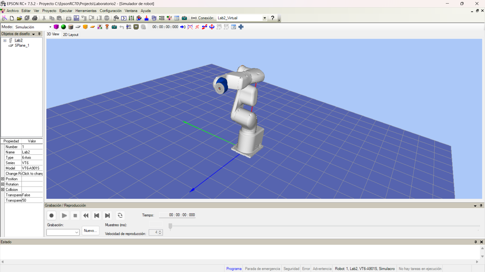
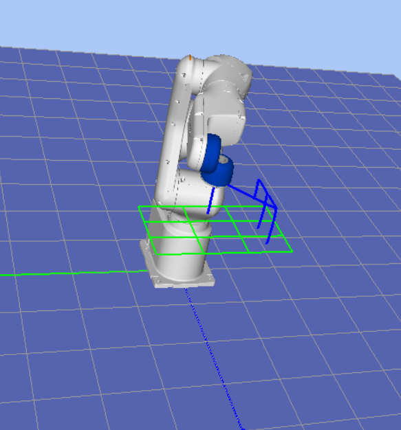
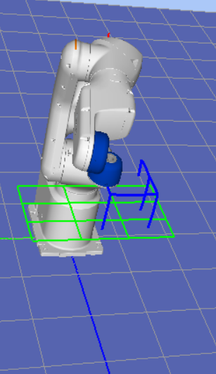
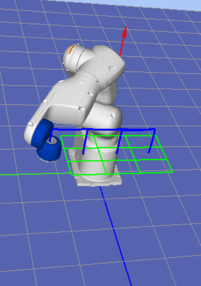
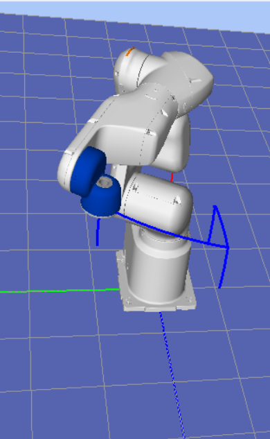

# Laboratorio 2 - Epson

***Participantes***
__Andres Camilo Torres Cajamarca__
__Brian Enrique Muñoz Garcia__

## Diagrama de flujo









## Desarrollo del codigo

```
Global Integer zh

Function main

Motor On
Power High
Accel 50, 50
Speed 50

Pallet 1, Origen, Ejey, Ejex, 3, 3
Pallet Outside, 2, Origen, Ejey, Ejex, 3, 3

zh = 700

Home

Do
If MemSw(512) Then
	Call paletizado_z
ElseIf MemSw(513) Then
	Call paletizado_s
ElseIf MemSw(514) Then
	Call paletizado_externo
ElseIf MemSw(515) Then
	Call LoopInf
EndIf
Loop

Fend
Function LoopInf

Go Origen :Z(zh)
Go Origen
Go Origen :Z(zh)
Wait 0.5
Go Ejey :Z(zh)
Go Ejey
Go Ejey :Z(zh)
Wait 0.5
Go Ejex :Z(zh)
Go Ejex
Go Ejex :Z(zh)
Wait 0.5

Fend
Function paletizado_z

Integer i

#define estado_paletizado_z 11 'Salida 11'

On estado_paletizado_z 'Encender Salida 11'

For i = 1 To 9
	Go Pallet(1, i) :Z(zh) 'Recorrer Pallet en orden'
	Go Pallet(1, i)
	Go Pallet(1, i) :Z(zh)
Next

Off estado_paletizado_z 'Apagar Salida 11'


Fend
Function paletizado_s

Integer i, j

#define estado_paletizado_s 12 'Salida 12'

On estado_paletizado_s 'Encender Salida 12'

j = 10
For i = 1 To 9
	If i > 3 And i <= 6 Then
		Go Pallet(1, j - i) :Z(zh) 'Recorrer Pallet en orden inverso'
		Go Pallet(1, j - i)
		Go Pallet(1, j - i) :Z(zh)
	Else
		Go Pallet(1, i) :Z(zh) 'Recorre Palet en orden'
		Go Pallet(1, i)
		Go Pallet(1, i) :Z(zh)
	EndIf
Next

Off estado_paletizado_s 'Apagar Salida 12'
Fend
Function paletizado_externo

Integer i, j

#define estado_paletizado_ex 13 'Salida 13'

On estado_paletizado_ex 'Encender Salida 13'

For i = 1 To 4
	For j = 1 To 4
		Go Pallet(2, i, j) :Z(zh)
		Go Pallet(2, i, j)
		Go Pallet(2, i, j) :Z(zh)
	Next
Next

Off estado_paletizado_ex 'Apagar Salida 13'

Fend

```

## Simulación

Para el desarrollo de la práctica, primero se realizó el código y se probó en el simulador EPSON RC+ 7.0



### Paletizado Z



### Paletizado S



### Paletizado OutSide



### Loop Infinito



El link donde se encuentra el video de la simulación es el siguiente:

[https://drive.google.com/file/d/1U-zmbMYqiF4tu-fsjmvXYLcLtj_zGSY5/view?usp=sharing](https://drive.google.com/file/d/1U-zmbMYqiF4tu-fsjmvXYLcLtj_zGSY5/view?usp=sharing)

## Práctica - CDM

El link donde se encuentra el video demostrativo del funcionamiento es el siguiente:

[https://drive.google.com/file/d/1NmMO5OG9JvqUB5NXfdz_Lp8jcq_xRi57/view?usp=sharing](https://drive.google.com/file/d/1NmMO5OG9JvqUB5NXfdz_Lp8jcq_xRi57/view?usp=sharing)
