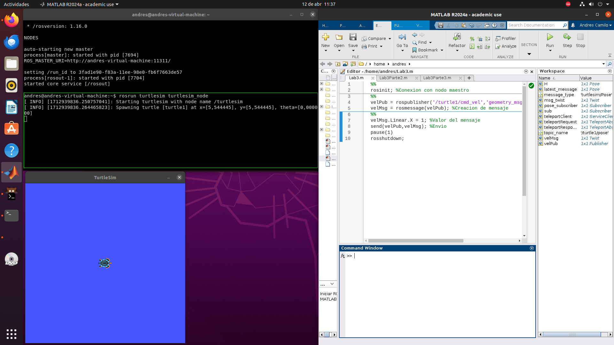
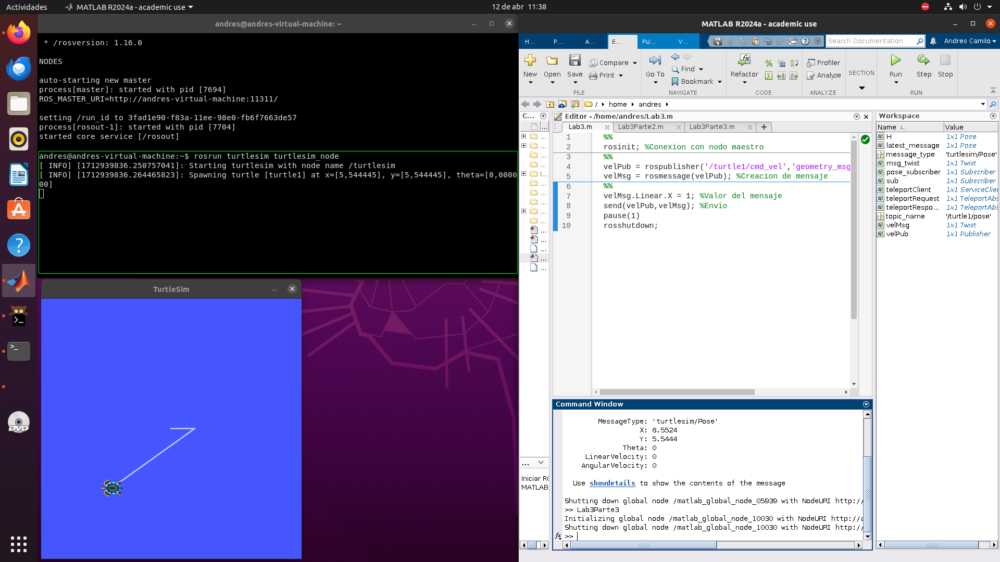

# Laboratorio 3 - Robótica de Desarrollo, Intro a ROS

***Participantes***

* Andres Camilo Torres Cajamarca
* Brian Enrique Muñoz Garcia
## Metodología

### Matlab:

Para esta sección se realizó la instalación de *ROS* y de *MATLAB* con las toolbox necesarias (*ROS Toolbox* y *ROBOTIC Toolbox*).

En primer lugar se empleó siguió el procedimiento descrito en la guia de laboratorio con la cual se abrieron las terminales para el uso de *ROS*, la pantalla de la simulación de *TurtleSim* y el *MATLAB.*



Empleando el siguiente script (Descrito en la guía de trabajo):

```
rosinit; %Conexion con nodo maestro
velPub = rospublisher('/turtle1/cmd_vel','geometry_msgs/Twist'); %Creacion publicador
velMsg = rosmessage(velPub); %Creacion de mensaje
velMsg.Linear.X = 1; %Valor del mensaje
send(velPub,velMsg); %Envio
pause(1)
rosshutdown;
```

Se logró conectar al nodo maestro de ROS y mediante un publicador al tópico *CMD_VEL* y un mensaje de tipo *Twist* , al cual se le puede asignar una velocidad en *X y Y* tanto lineal como angular, asignando sólo el valor de *1* en el parametro X lineal, la tortuga se movió en sentido *X* positivo. El resultado se puede ver en la siguiente imagen:


Como siguiente tarea se encontraba el buscar como mediente un script de *MATLAB* se podía averiguar la pose de la tortuga, para ello se creó el siguiente script:

```
% Iniciar el nodo de ROS en MATLAB
rosinit;

% Definir el nombre del tópico y el tipo de mensaje
topic_name = '/turtle1/pose';
message_type = 'turtlesim/Pose';

% Crear el suscriptor
pose_subscriber = rossubscriber(topic_name, message_type);

% Esperar para asegurarse de que se reciba al menos un mensaje
pause(1);

% Capturar el último mensaje recibido
latest_message = receive(pose_subscriber, 1);

% Mostrar la información de la última pose recibida
disp('Última pose recibida:');
disp(latest_message);

% Finalizar el nodo de ROS en MATLAB
rosshutdown;
```

Con este script se permite escuchar el tópico *pose* de la tortuga obteniendo un mensaje de tipo *pose* que lo muesta en la consola de *MATLAB*, como se puede ver en la siguiente imagen


Por último se pedia crear un script capaz de, mediante los paramentros de una Pose, hacer mover la tortuga a dicha posición, para ello se empleó el siguiente script:

```
% Iniciar ROS en MATLAB
rosinit;

% Crear un cliente de servicio para el servicio teleport_absolute
teleportClient = rossvcclient('/turtle1/teleport_absolute');

% Crear una solicitud de servicio
teleportRequest = rosmessage(teleportClient);

% Definir las coordenadas de la posición deseada
teleportRequest.X = 3.0; % Posición en el eje x
teleportRequest.Y = 3.0; % Posición en el eje y
teleportRequest.Theta = pi; % Ángulo de orientación

% Llamar al servicio teleport_absolute
teleportResponse = call(teleportClient, teleportRequest);

% Cerrar ROS en MATLAB
rosshutdown;
```

Con este script se crea una solicitud de servicio de tipo *Teleport_Absolute* que permite enviar a la tortuga a una posición deseada enviandole 3 parametros (*X*, *Y* y *Theta*) en coordenadas absolutas, es decir que son con respecto a el origen del plano y no con respecto a la posicion actual de la tortuga; el resultado se muestra en la siguiente imagen:



### Python:

Para esta sección del laboratorio fue necesario crear un script dentro del paquete *hello_turtle* el cual permitiera operar una tortuga del paquete *turtlesim* con el teclado. El script realizado tiene por nombre [myTeleopKey.py](https://github.com/vahernandezmo/robotica_lab/blob/master/Laboratorio_3/python/myTeleopKey.py)

Primero se importan las librerías necesarias para correr los nodos de ROS y para capturar las teclas presionadas.

```
import rospy
from geometry_msgs.msg import Twist
from turtlesim.srv import TeleportAbsolute, TeleportRelative
from std_srvs.srv import Empty
import termios, sys, os
from numpy import pi
```

Posteriormente, delcaramos como constantes tanto el topic para publicar la velocidad, como los servicios para poder ubicar la tortuga en el centro o girarla 180°.

```
cmd_vel_topic = '/turtle1/cmd_vel'
teleport_ab = '/turtle1/teleport_absolute'
teleport_rel = '/turtle1/teleport_relative'
```

La función `getkey()` (obtenida en este enlace: [http://python4fun.blogspot.com/2008/06/get-key-press-in-python.html](http://python4fun.blogspot.com/2008/06/get-key-press-in-python.html)), se utiliza para capturar la tecla presionada por el usuario.

```
def getkey():
    fd = sys.stdin.fileno()
    old = termios.tcgetattr(fd)
    new = termios.tcgetattr(fd)
    new[3] = new[3] & ~TERMIOS.ICANON & ~TERMIOS.ECHO
    new[6][TERMIOS.VMIN] = 1
    new[6][TERMIOS.VTIME] = 0
    termios.tcsetattr(fd, TERMIOS.TCSANOW, new)
    c = None
    try:
        c = os.read(fd, 1)
    finally:
        termios.tcsetattr(fd, TERMIOS.TCSAFLUSH, old)
    return c
```

Dependiendo de la tecla que se presione, se realizará un procedimiento diferente:

* Se debe mover hacia adelante y hacia atrás con las teclas W y S
* Debe girar en sentido horario y antihorario con las teclas D y A
* Debe retornar a su posición y orientación centrales con la tecla R
* Debe dar un giro de 180° con la tecla ESPACIO

Las funciones `pubVel()` y `teleport()` se declaran como funciones de ayuda para enviar los mensajes al tópico de velocidad y para llamar a los servicios necesarios para teletransportar la tortuga.

```

def get_action(): 
    key = getkey()
    if key == b'w' or key == b'W':
        pubVel(1,0)
    elif key == b's' or key == b'S':  
        pubVel(-1,0)
    elif key == b'd' or key == b'D':
        pubVel(0,-1)
    elif key == b'a' or key == 'A':
        pubVel(0,1)
    elif key == b'r' or key == 'R':
        teleport('abs')
    elif key == b' ':
        teleport('rel')
```

Definimos la función `pubVel()` con dos parámetros: `linear` y `angular`, valores que corresponden a la velocidad que asignaremos a la tortuga.

En esta primera línea, indicamos que nuestro nodo va a publicar al tópico `/turtle1/cmd_vel` usando un tipo de mensaje  *Twist* .

```
def pubVel(linear, angular):
    pub = rospy.Publisher(cmd_vel_topic, Twist, queue_size=10)
```

Luego, declaramos el mensaje como un mensaje de tipo *Twist* y le asignamos los valores correspondientes a la velocidad lineal y la velocidad angular. Por último, publicamos el mensaje.

```
    message = Twist()
    message.linear.x = linear
    message.angular.z = angular
    pub.publish(message)
```

En la función `teleport()`, llamaremos a los servicios correspondientes para lograr que la tortuga regresa a su lugar de inicio o que gire 180°.

En el primer caso, llamamos al servicio `/turtle1/teleport_absolute`, con el cual podemos mover la tortuga a un lugar indicado por tres parámetros: `x`, `y` y `theta`. Estos valores son los mismos que se obtienen al iniciar el nodo de turtlesim.

Además, también se llama al servicio `clear`, con el cual se limpia el fondo de la ventana del turtlesim.

```
def teleport(key):
    if key == 'abs':
        rospy.wait_for_service(teleport_ab)
        try:
            teleport_absolute = rospy.ServiceProxy(teleport_ab, TeleportAbsolute)
            teleport_abs_result = teleport_absolute(5.544445,5.544445,0)

            rospy.wait_for_service('/clear')
            clearTrajec = rospy.ServiceProxy('/clear', Empty)
            Reset = clearTrajec()
        except rospy.ServiceException as e:
            print(str(e))
```

En el segundo caso, se llama al servicio `/turtle1/teleport_relative`, el cual mueve la tortuga una distancia lineal y angular determinadas con respecto a la posición actual de la torguga. Como queremos que gire 180°, la distancia lineal es 0 y la angular es pi.

```
    elif key == 'rel':
        rospy.wait_for_service(teleport_rel)
        try:
            teleport_relative = rospy.ServiceProxy(teleport_rel, TeleportRelative)
            teleport__relative_result = teleport_relative(0,pi)
        except rospy.ServiceException as e:
            print(str(e))
```

En el programa principal damos un mensaje de entrada, donde se indica cuales teclas se utilizan para mover la tortuga.

```
if __name__ == '__main__':
  
    welcome = """
    Made by: Andres Camilo Torres Cajamarca, Brian Enrique Muñoz Garcia
    --------------------------------------------------------------
    Reading from keyboard
    --------------------------------------------------------------
    Use AWSD to move the turtle
    Use 'R' to clear canvas and teleport the turtle to starting position
    Use Space Bar to rotate the turtle 180°
    Use 'q' to quit
    --------------------------------------------------------------
    """
```

Por último, inicializamos un nodo al que nombramos `my_teleop_key`, utilizamos la función `rospy.loginfo()` para mostrar el mensaje, y declaramos un ciclo en el que mientras que no se cierre ROS (con `q` o `CTRL+C`), llamamos a la función `get_action()`, la cual moverá a la tortuga según la tecla correspondiente.

```
    try:
            rospy.init_node('my_teleop_key')
            rospy.loginfo(welcome)
            rate = rospy.Rate(10) # 10hz
            while not rospy.is_shutdown():
                get_action()
                rate.sleep()

    except rospy.ROSInterruptException:
            pass
```

## Resultados

El link donde se encuentra el video de la simulación de MatLab es:

[https://drive.google.com/file/d/1QuIyPr4Sos44YuqAVYN-qbetXw8ObIxZ/view?usp=sharing](https://drive.google.com/file/d/1QuIyPr4Sos44YuqAVYN-qbetXw8ObIxZ/view?usp=sharing)

## Conclusiones

El presente laboratorio permite hacer una introducción a *ROS* por medio del uso de *tourtlesim* empleando diversos temas esenciales como lo son suscribtores, publicadores, topicos, mensajes, servicios, etc. todo esto con la finalidad de saber como pueden ser emleados para diversas tareas y objetivos de futuros laboratorios.
