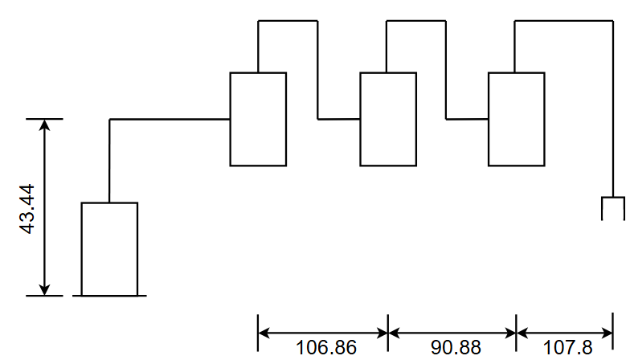
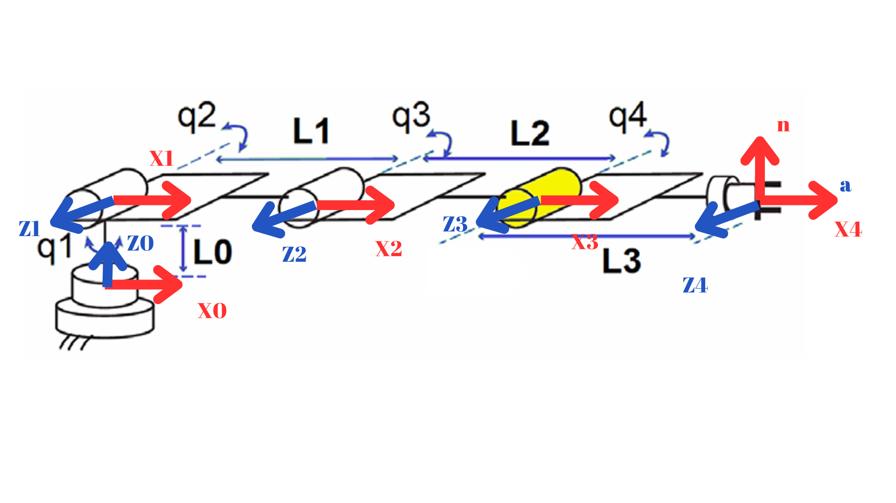
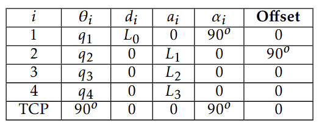
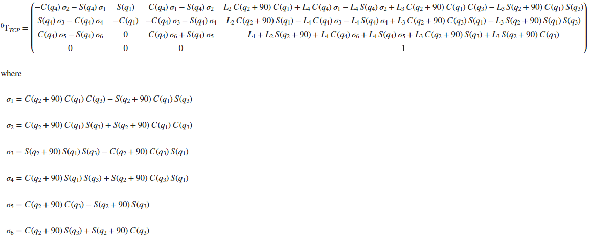
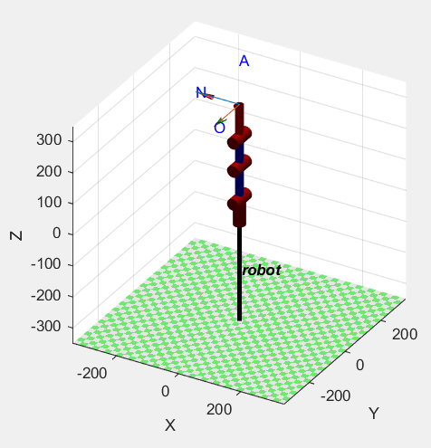
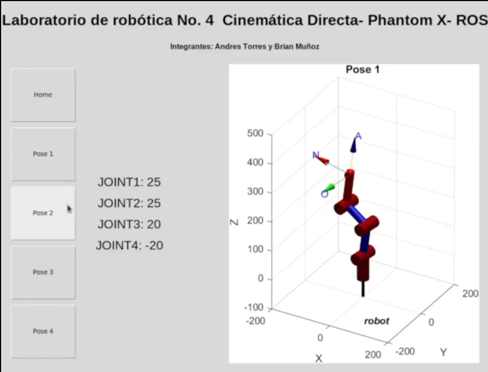

# Laboratorio 4 - Cinemática Directa- Phantom X- ROS

### ***Participantes***

* Andres Camilo Torres Cajamarca
* Brian Enrique Muñoz Garcia

## Metodología

### Mediciones:

Se tomaron las distancias minimas entre los ejes de cada motor y se realizó un primer boceto como se puede observar a continuación:



### Análisis:

Para realizar el analisis de cinemtaica directa se realizó otro dibujo y se hizo el procedimiento aprendido en clase



Parámetros DH del robot Phantom X Pincher:



### Cinemática directa

Una vez teniendo los parametros DH del robot se empleó la función "DH.mlx" para encontrar la matriz de transformación desde la base hasta el TCP



### SerialLink (MATLAB)

Para la creación de la simulación en MatLab se investigó sobre el funcionamiento de esta función y se creó el robot en posición de HOME en matlab como se ve en la siguiente figura



Y esta fue la tabla DH generada al realizar el SerialLink

```
Robot = 
 
robot:: 4 axis, RRRR, stdDH, slowRNE                       
+---+-----------+-----------+-----------+-----------+-----------+
| j |     theta |         d |         a |     alpha |    offset |
+---+-----------+-----------+-----------+-----------+-----------+
|  1|         q1|      43.44|          0|     1.5708|          0|
|  2|         q2|          0|     106.86|          0|     1.5708|
|  3|         q3|          0|      90.88|          0|          0|
|  4|         q4|          0|      107.8|          0|          0|
+---+-----------+-----------+-----------+-----------+-----------+
tool:    t = (0, 0, 0), RPY/xyz = (-135, 90, -135) deg     
 
```

## ROS

Se realizó la instalación y configuración descrita en el repositorio [Robotics - UNAL - LAB3](https://github.com/fegonzalez7/rob_unal_clase3) de  y se realizaron los siguientes cambios en el archivo basic.yaml [catkin_ws/src/dynamixel_one_motor/config/basic.yaml]

```
waist:
  ID: 1
  Return_Delay_Time: 0

shoulder:
  ID: 2
  Return_Delay_Time: 0
  
elbow:
  ID: 3
  Return_Delay_Time: 0

wrist:
  ID: 4
  Return_Delay_Time: 0

hand:
  ID: 5
  Return_Delay_Time: 0
```

Una vez realizados estos cambios se modificó y empleó el script "jointSrv.py" [catkin_ws/src/dynamixel_one_motor/scripts/jointSrv.py] para corroborar si todo funcionaba correctamente

A partir de este script se creó el Script llamado "Script1.py" para cumplir con los requerimientos descritos en la guía de trabajo. En el cual se leía una entrada por parte del usuario de los 4 grados de cada servomotor (asumiendo siempre 0 para el quinto) y este script convertia los valores asignados en valores que los motores pudieran reconocer y los mandaba por medio de los comando de Dynamixel.

Nota: Es necesario tener en cuenta que si se tiene el Dynamixel Wizard ejecutandoce se requiere que este esté desconectado de lo contrario ROS no podrá identificar los motores y generara error

## HMI

Para el desarrollo de la interfaz se empleó la librería "Tkinter" la cual permite crear interfaces graficas de usuario GUI en Python. La interfaz se puede apreciar en la siguiente imagen



Esta interfaz llamada HMI.py se unió el Script creado en python llamado Script1.py e imagenes generadas en MatLab.

## Resultados

Vídeo del brazo alcanzando cada posición solicitada y demostración de uso de la interfaz de usuario.

[https://drive.google.com/file/d/1xkThAWf9IHRIQZQI4dn2cfCvEYGdaHWz/view?usp=sharing](https://drive.google.com/file/d/1xkThAWf9IHRIQZQI4dn2cfCvEYGdaHWz/view?usp=sharing)

Gráfica digital de las poses comparándola con la fotografía del brazo real en la misma configuración.
